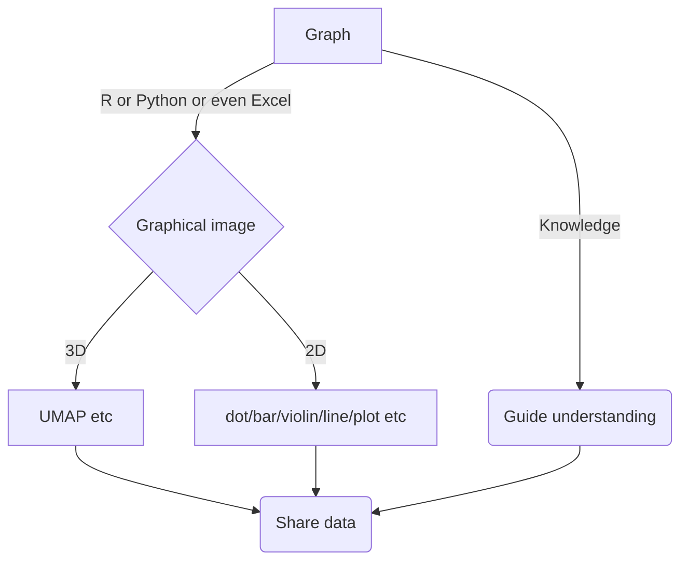
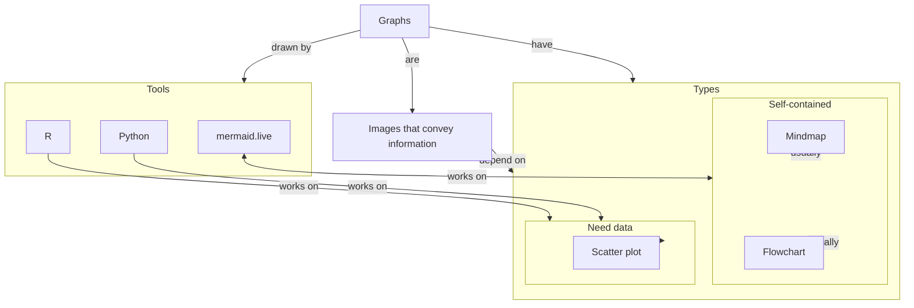
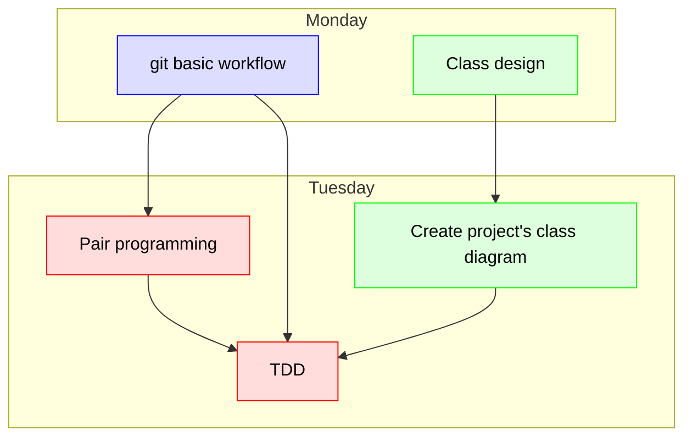

# Mermaid_course
Graphs from Mermaid lecture

Just for testing and learning purposes

flowchart TD
  classDef graph_node fill:#fdd,color:#000,stroke:#f00
  classDef lars_node fill:#dfd,color:#000,stroke:#0f0
  classDef richel_node fill:#ddf,color:#000,stroke:#00f
  A[Graph]:::graph_node
    A[Graph] -->|R or Python or even Excel| C{Graphical image}
    A[Graph] -->|Knowledge| B(Guide understanding)
    C -->|2D| D[dot/bar/violin/line/plot etc]
    C -->|3D| E[UMAP etc]
    E[UMAP etc] --> F(Share data)
    D[dot/bar/violin/line/plot etc] --> F(Share data)
    B(Guide understanding) --> F(Share data)
    C{Graphical image}:::richel_node
    F(Share data):::lars_node
